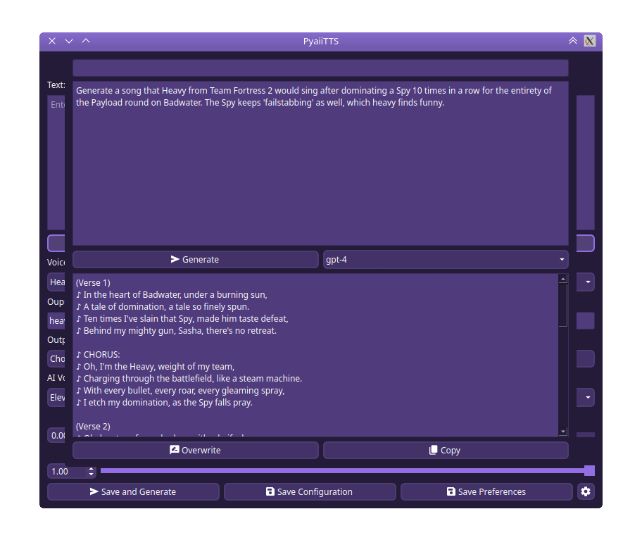

# PyaiiTTS 
**Py**<sub>thon</sub>**a**<sub>rtificial</sub>**i**<sub>ntelligence</sub>**i**<sub>nterface</sub>**T**<sub>ext</sub>**T**<sub>o</sub>**S**<sub>peech</sub><br>_<sub>100% didn't accidentally spell it with an extra i on accident or anything</sub>_<br>
A simple python program that generates an mp3 of an AI voice using [ElevenLabs](https://elevenlabs.io).

> [!Important]
> On Linux, you need to install a CLI clipboard interface (`xclip` or `wl-clipboard`) for `pyclip` to use (if one isn't already).
> - X11:
>     - ```
>       sudo pacman -Sy xclip # Arch
>       ```
>     - ```
>       sudo apt update && sudo apt install xclip # Debian-based
>       ```
> - Wayland:
>     - ```
>       sudo pacman -Sy wl-clipboard # Arch
>       ```
>     - ```
>       sudo apt update && sudo apt install wl-clipboard # Debian-based
>       ```

> [!Tip]
> All versions of PyaiiTTS support Linux and Windows.<br>
> **macOS is only supported for ≥v1.3 (release)**<br>
> ~~If you want to use an older version on macOS, please [build from an older version](#build-version-from-zip-archive).~~<br>
> You may now install older versions from the [installer](https://github.com/datbogie/pyaiitts-installer/releases/latest) too.<br>
> _If on macOS_, you can download versions directly from the respective release page, as (on macOS only) the binary contains the assets folder.<br>
> Note that (especially on macOS), running older (≤v1.3-pre2) versions through shortcuts/links (or the `.app` binary) **will not work**; PyaiiTTS won't be able to load any `.json` files or assets, as it was looking in the wrong directory prior to the fix implemented first in v1.3-pre3.<br>
> *Otherwise,* **please don't download from the releases page directly. _Instead..._**

### [DOWNLOAD HERE](https://github.com/DatBogie/PyaiiTTS-Installer/releases/latest)

*Or...*

> [!Important]
> The following installation methods require Python to be installed.<br>
> - On Linux, it should already be installed.<br>
> - On Windows, the easiest way is to do so is to simply install it from the Microsoft Store.<br>
> - On macOS, it should already be installed. If you encounter problems, try installing the latest version [here](https://www.python.org/downloads/).<br>
> **Make sure to add Python to PATH as well!**

## Build from Source
> [!Important]
> Make sure Git is installed.<br>
> - Windows: [download here](https://gitforwindows.org).
> - Linux:
>     - ```
>       sudo pacman -Sy git # Arch
>       ```
>     - ```
>       sudo apt update && sudo apt install git # Debian-based
>       ```
> - macOS:
>   ```
>   git --version
>   ```

1. Clone this repo.
    Run the following in a terminal emulator or PowerShell:
    ```sh
   git clone https://github.com/DatBogie/PyaiiTTS && cd PyaiiTTS
    ```
3. Run the build file for your OS.
    This will create a venv and install all needed Python modules before building an executable.
    You will find the executable in `./dist/` (`.\dist\` on Windows)
    - **Linux:**
    ```sh
    ./build-linux.sh
    ```
    - **Windows:**
    ```sh
    .\build-windows.bat
    ```
    - **macOS:**
    ```sh
    ./build-mac.sh
    ```

*Or or...*

## Build Version from ZIP Archive
> [!Tip]
This isn't very useful anymore. Please just use [the installer](https://github.com/DatBogie/PyaiiTTS-Installer/releases).

1. Download the ZIP archive of the version you would like (you can find those [here](https://github.com/DatBogie/PyaiiTTS/releases)) and extract its contents into a folder.
2. Download the `requirements.txt` file from this repo [here](requirements.txt) and put it in the folder your extracted into above.
3. Download the build script for your OS from this repo and place it in the aformentioned folder.
    - **Linux:** [build-linux.sh](build-linux.sh)
    - **Windows:** [build-windows.bat](build-windows.bat)
    - **MacOS:** [build-mac.sh](build-mac.sh)
4. Run the build file. An executable file should appear in the `dist` folder.

&nbsp;
> [!Note]
PyaiiTTS will create files such as `conf.json`, `pref.json`, `themes.json`, and `voices.json` in the directory that the executable is placed in!

&nbsp;
## Screenshots:
<sup>_(Hover an image for a caption.)_</sup>

<span title="PyaiiTTS v1.3 (release) running on macOS Ventura.&#010;macOS widgets and system theme are in use."></span>
<span title="PyaiiTTS v1.3 (release) running on Linux with KDE Plasma 6.2.&#010;Fusion widgets and custom 'Crocus Purple' theme are in use."></span>
